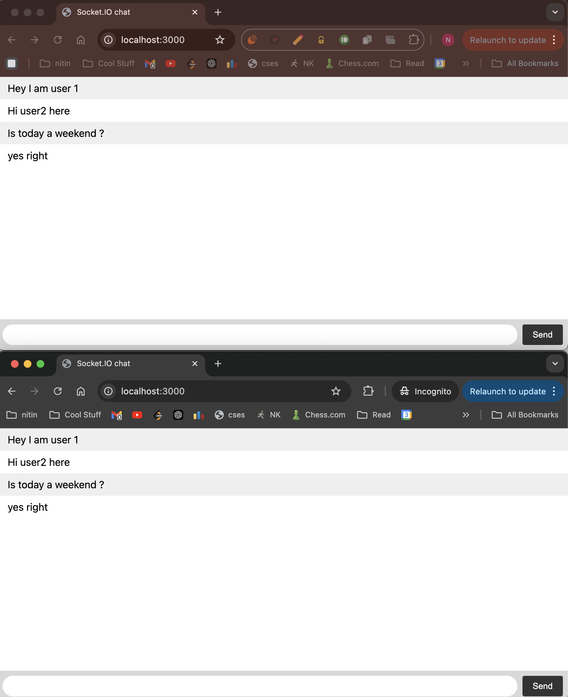

## Overview of WebSockets
- Full duplex communication (Client can talk to server  <-> Server can talk to Client)
- Under the hood we have a single long live TCP connection
- Continuous bi-directional communication

### Communication
- First Client sends an Handshake(HTTP upgrade) request to Server
- Server opens the connection and then a Long Live TCP connection is established
- Now both client and server send messages back and forth over this tcp connection.
- Once client/server does logout it closes the connection.
	

## Challenges
- Resource Usage (as number of user increases the no of long live TCP connection increases)
- Connection limits
- Sticky Sessions (as load on server increases how we will manage the connection to already established client from different server)

#### Output
